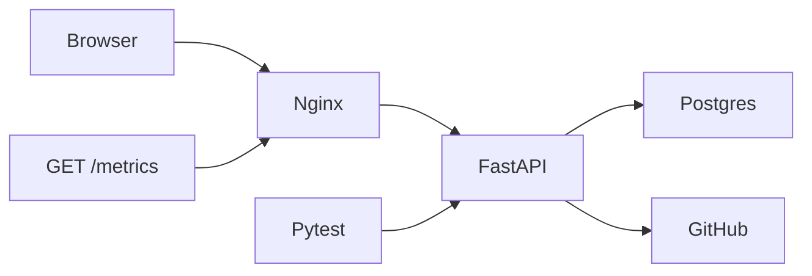
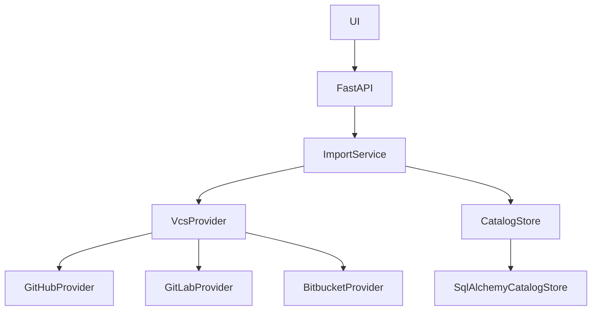

# Conceptual questions

## 1. How did you debug this project, and with which tools?

I treated Docker Compose as the runtime, not a local Python/Node install. Make is optional (`make logs`, `make psql`, `make metrics`); the Compose commands in [SETUP.md](SETUP.md) do the same thing.

- **Backend logs:** Uvicorn access lines plus **structlog JSON** on stdout (`sync.started` / `sync.finished`, GitHub 4xx). I follow them with `make logs` or `docker compose logs -f backend`. Import failures still show up on the HTTP payload (`last_sync_status`, `last_sync_error`) so the UI can display them; the JSON line is what I use when I need duration, imported/skipped counts, and status without opening the network tab.
- **Metrics:** `GET /metrics` (Prometheus text). After a live import I check `catalog_sync_total`, `catalog_sync_duration_seconds`, and `github_api_responses_total` via `make metrics` or `curl http://localhost:8080/metrics`.
- **HTTP:** browser devtools against `http://localhost:8080/api/...` (nginx proxies `/api` and `/metrics`, so CORS is not in the way).
- **Database:** `make psql` or `docker compose exec db psql -U circunomics -d circunomics` to inspect `repositories` / `commits` when checking idempotency by hand.
- **Tests:** `make test` (or `docker compose run --rm --no-deps --build backend pytest`) in the backend image.
- **GitHub:** if an import failed live, `last_sync_error` (including <a href="https://docs.github.com/en/rest/using-the-rest-api/rate-limits-for-the-rest-api" target="_blank" rel="noopener noreferrer">rate-limit</a> headers) and the matching `github.response` / `sync.finished` log line were the first signal; mocked `httpx` transports covered the same paths in tests.

## 2. What is your approach to testing this project, and what did you choose to leave untested?

I tested the behaviour Circunomics said they would weigh: **correctness of import and of server-side queries**. I also asserted the observability I added, so a change that breaks `sync.finished` or `/metrics` fails CI.

Covered:

- Re-import does not duplicate repositories or SHAs (required)
- A rate-limit on page 2 keeps page 1 and records `partial`
- Missing GitHub repo: empty row deleted, existing commits kept
- Contributors search, date filter, sort, and pagination
- GitHub adapter mapping, 404, 409, 429, and 5xx
- structlog events for success / partial / failed (including `deleted`)
- Prometheus series on `GET /metrics` after a successful import

I left untested, deliberately:

- Vue rendering and CSS (visual design is out of scope; the states are obvious in the DOM)
- Docker/nginx wiring and the Makefile (validated by `make up` / `docker compose up`, not an assertion)
- Live GitHub (flaky, quota-consuming, not about my code)
- SQLAlchemy/FastAPI/prometheus-client themselves
- A Grafana dashboard (I expose `/metrics`; I did not add a collector)

Those would grow the suite without protecting the data model.

## 3. You now need to support GitLab and Bitbucket. Walk through what changes in your code and what doesn't.

**Does not change:** ORM schema (except `provider`), `CatalogStore`, import idempotency, contributor queries, Vue, REST shape.

**Changes:** a new `VcsProvider` class (GitLab / Bitbucket HTTP mapping), wiring in `get_provider()`, and how the user names the provider.

The unique key is already `(provider, owner, name)`, so `octocat/Hello-World` on GitHub and GitLab can coexist.

## 4. A user imports a repository with 500,000 commits and the contributors page becomes unusable. Where do you look first, and what are your options?

I would look at the **`GROUP BY` on `commits`** first, not the Vue table. Pagination only slices the aggregated result; Postgres still has to aggregate the matching rows. `EXPLAIN ANALYZE` on that query, then indexes on `(repository_id, committed_at)` and `(repository_id, lower(author_email), lower(author_name))`.

Options, cheapest first:

1. Keep the 1000-commit import cap (already in place) so this dataset cannot exist unless I raise the cap.
2. If I must store hundreds of thousands of rows: a materialized contributor summary table, refreshed after sync; filter/sort/page that table.
3. Tighten date filters by default (last 90 days) so the aggregate does not scan history.
4. Only then consider search engines or a warehouse. The slowness is almost certainly the on-read aggregate, not JSON rendering of 20 rows.

## 5. Which part of your solution would you not ship to production as-is, and why?

The **synchronous import on a public, unauthenticated API**.

Anyone who can open port 8080 can point the app at arbitrary GitHub repos, occupy a worker for minutes, and spend the GitHub token’s quota. Schema creation via `create_all`, a shared token, and no per-user isolation are in the same bucket.

I would keep the data model and the provider interface. I would not keep: request-thread imports, token-as-env-for-the-whole-app, or “create tables on boot” as the migration story.
