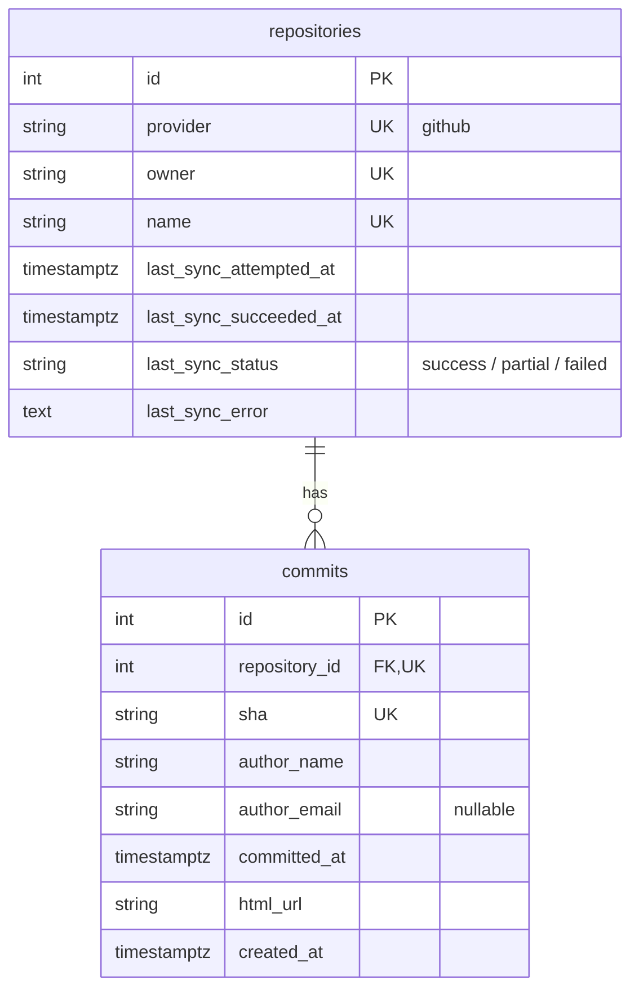
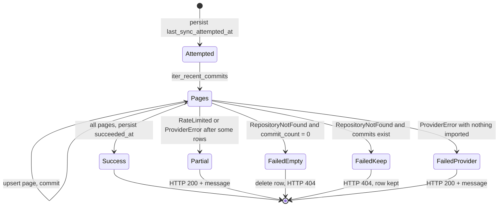
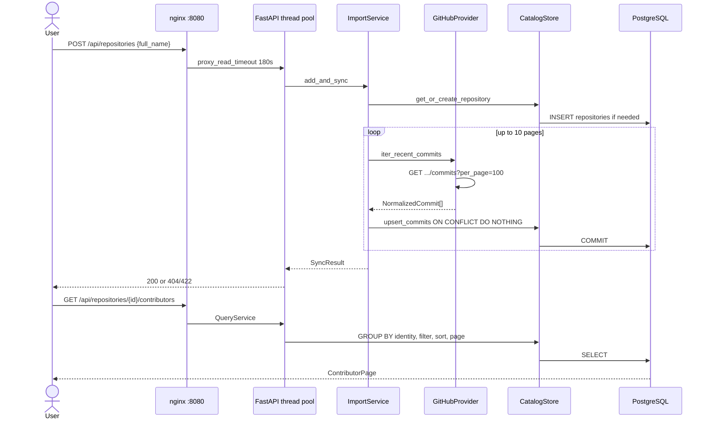

# C4 Level 4 — Code, data, and runtime flows

C4 “code” is the tables, the import state machine, and how a browser request reaches SQL or GitHub.

## Data model

Contributor identity is **not** a table. Queries group by `coalesce(nullif(lower(author_email), ''), lower(author_name))`. The UI passes that key as url-safe base64 (`identity.encode_contributor_key`).

## Import state machine

Each page is committed before the next GitHub GET. Re-import uses `ON CONFLICT DO NOTHING` on `(repository_id, sha)`.

## Request paths

## Observability (same process, not extra containers)

| Signal | Where | Shape |
| --- | --- | --- |
| Logs | stdout | structlog JSON: `sync.started`, `sync.finished`, `github.response` |
| Metrics | `GET /metrics` | `catalog_sync_total{status}`, `catalog_sync_duration_seconds`, `github_api_responses_total{status_code}` |
| HTTP access | Uvicorn | default access log |
| Health | `GET /api/health` | `{status: ok}` after `SELECT 1`; 503 `{status: unavailable}` when Postgres does not answer |

## Test runtime (not the Compose graph)

Pytest uses SQLite in-memory, a no-op FastAPI lifespan, and `FakeProvider`. That is why `make test` uses `--no-deps` and does not start Postgres or nginx.

## Deliberately absent from every diagram

GitLab/Bitbucket adapters, Alembic, Celery/Redis, Grafana, Prometheus server, authentication, job progress polling.
